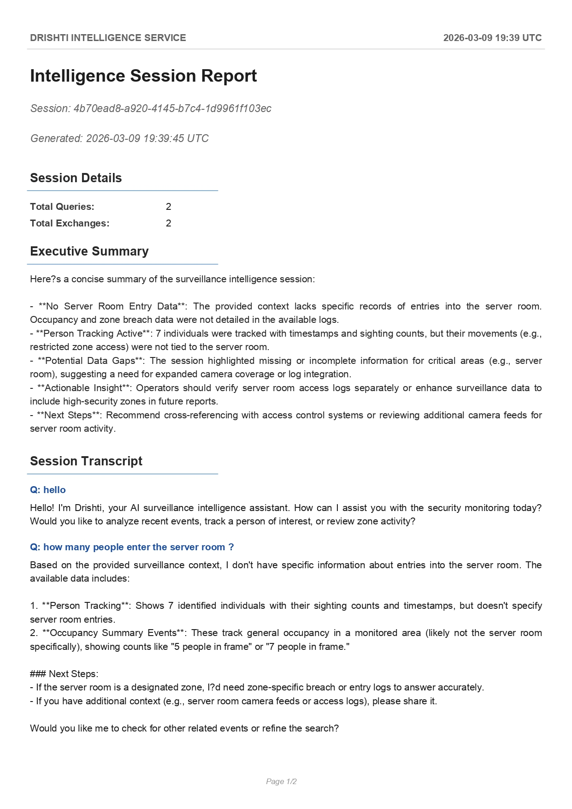
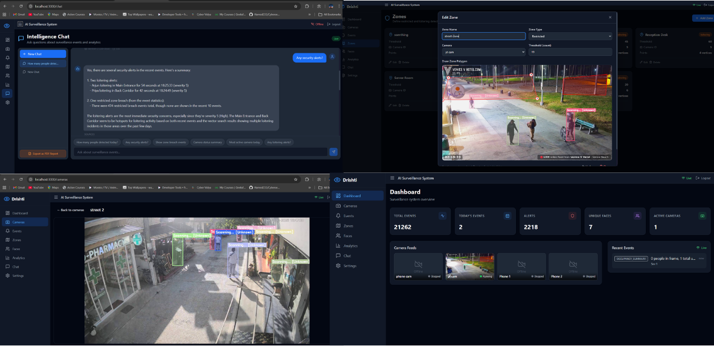
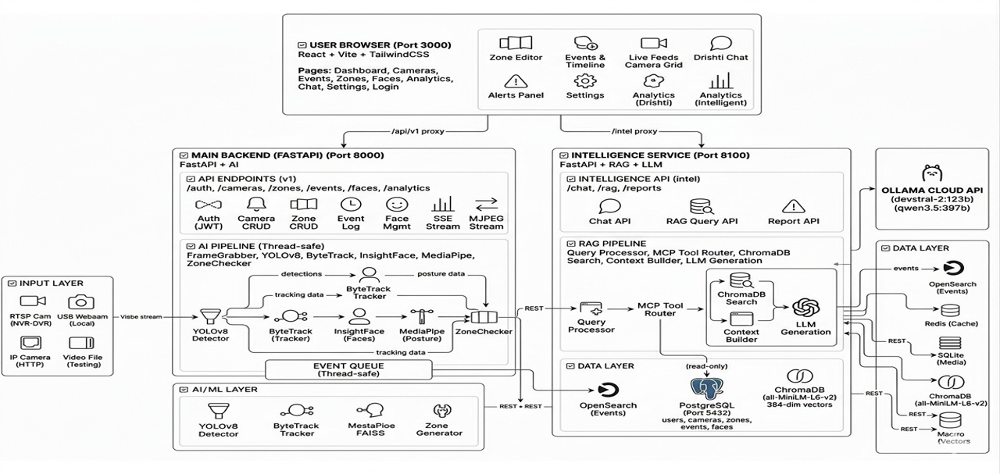

<div align="center">

# 👁️ Drishti
### A RAG-Augmented Conversational AI Framework for Real-Time Intelligent Video Surveillance

*Drishti (Sanskrit: "Vision") — Ask your surveillance system a question. Get an answer.*

[](./docs/Drishti_IEEE_Paper.pdf)
[](./docs/Drishti_Research_Paper.pdf)
[](./docs/ARCHITECTURE.md)


</div>

---

## 📽️ Demo

> **The core idea:** a security operator types *"Where was Raman last seen?"* and gets a grounded answer — not a list of bounding boxes.

| Demo 1 — Loitering & Restricted Zone Detection | Demo 2 — Live AI Pipeline in Action |
|---|---|
| [](https://drive.google.com/file/d/1InDimGqpz8KqcfTru1yX90mEDjskeNkM/view?usp=sharing) | [](https://drive.google.com/file/d/1BZ-oY7noXRRP4DKkxoXnVpPXK1PAetce/view?usp=sharing) |

---

## 📸 Screenshots

<table>
  <tr>
    <td align="center"><strong>Main Dashboard</strong></td>
    <td align="center"><strong>Live Camera + AI Overlays</strong></td>
  </tr>
  <tr>
    <td></td>
    <td></td>
  </tr>
  <tr>
    <td align="center"><strong>Zone Editor</strong></td>
    <td align="center"><strong>Camera Management</strong></td>
  </tr>
  <tr>
    <td></td>
    <td></td>
  </tr>
  <tr>
    <td align="center"><strong>Intelligence Chat (RAG)</strong></td>
    <td align="center"><strong>Events Log</strong></td>
  </tr>
  <tr>
    <td></td>
    <td></td>
  </tr>
  <tr>
    <td align="center"><strong>PDF Intelligence Report</strong></td>
    <td align="center"><strong>Combined View</strong></td>
  </tr>
  <tr>
    <td></td>
    <td></td>
  </tr>
</table>

---

## 🧠 What is Drishti?

Modern surveillance systems are great at detection — but terrible at answering questions. They give you bounding boxes and alert logs. An operator still has to sit there and watch, or scroll through thousands of events manually.

**Drishti adds a conversational layer on top of real-time surveillance.**

The system processes live camera feeds through a multi-stage AI pipeline, converts every detection event into searchable text, embeds them into a vector database, and exposes a hybrid RAG query interface — combining 5 MCP-backed SQL tools for precision with ChromaDB vector search for semantic context.

**Tested on 21,000+ real surveillance events:**
- ⚡ Natural language query response: **3–5 seconds end-to-end**
- 🎯 Face recognition accuracy: **~95%** (enrolled faces, two-tier threshold)
- 📷 Detection speed: **30 FPS** per camera (NVIDIA GPU + CUDA)
- 💾 Storage vs raw video: **99.5% reduction** (structured events only)
- 🔄 Event sync throughput: **1,000 events per 60-second batch**

---

## 🏗️ System Architecture

Three independently deployable microservices over HTTP REST + SSE, with PostgreSQL as the shared data layer.

```
┌─────────────────────────────────────────────────────────────┐
│              FRONTEND — React + Vite (Port 3000)            │
│   Dashboard | Cameras | Events | Zones | Faces | Chat | AI  │
└──────────────────┬──────────────────────┬───────────────────┘
                   │ /api/v1 proxy        │ /intel proxy
                   ▼                      ▼
   ┌───────────────────────┐   ┌──────────────────────────┐
   │  BACKEND (Port 8000)  │   │  INTELLIGENCE (Port 8100) │
   │                       │   │                           │
   │  AI Detection Pipeline│   │  Query Processor          │
   │  YOLOv8n Detection    │   │  Intent Classifier        │
   │  ByteTrack Tracking   │   │  MCP Tool Router          │
   │  InsightFace + FAISS  │   │  ChromaDB Vector Search   │
   │  MediaPipe Pose       │   │  Context Builder (4k cap) │
   │  Zone Checker         │   │  LLM Generation           │
   │  Event Queue (1000)   │   │  (Ollama Cloud API)       │
   └──────────┬────────────┘   └─────────────┬────────────┘
              │ write                         │ read-only
              ▼                               ▼
        ┌─────────────────────────────────────────┐
        │         PostgreSQL (Port 5432)           │
        │  Tables: users, cameras, zones,          │
        │          events, faces                   │
        └─────────────────────────────────────────┘
```

📐 Full architecture diagram:


---

## 🔬 AI Detection Pipeline

Each camera feed runs in a dedicated `DrishtiProcessor` thread. Every frame goes through this sequence:

```
Frame
  │
  ▼
YOLOv8n  ──────────────────────────────  Person detection (30 FPS, CUDA)
  │
  ▼
ByteTrack  ─────────────────────────────  Persistent track IDs (2-stage association,
  │                                        threshold: 0.25, buffer: 60 frames)
  ▼
InsightFace + FAISS  ────────────────────  512-dim face embeddings + similarity search
  │                                        Two-tier threshold: 0.35 (registered)
  │                                        0.50 (auto-detected), hard block at 0.30
  ▼
MediaPipe Pose  ─────────────────────────  Standing / Sitting / Lying classification
  │
  ▼
Zone Checker  ───────────────────────────  6-point polygon intersection (cv2.pointPolygonTest)
  │                                        Restricted (severity 9), Loitering (5–7)
  ▼
Event Generator  ────────────────────────  State-change detection, 5-sec cooldown
  │                                        Queue (maxsize 1000) → PostgreSQL @ 10 Hz
  ▼
SSE Broadcast ───────────────────────────  Real-time push to all connected frontends
```


---

## 🤖 RAG + MCP Query Pipeline

The intelligence service is the core research contribution of Drishti. It combines SQL precision with semantic search under a strict context budget.

```
User Query: "Where was Raman last seen?"
      │
      ▼
Intent Classifier ──────────────────────  5 categories:
      │                                    PERSON_LOOKUP, ZONE_QUERY,
      │                                    EVENT_SEARCH, SUMMARY, GENERAL
      ▼
MCP Tool Router ──────────────────────── 5 SQL-backed tools:
      │                                    tool_person_tracker()
      │                                    tool_zone_monitor()
      │                                    tool_recent_events()
      │                                    tool_event_stats()
      │                                    tool_occupancy()
      ├──────────────────────────────────
      │
ChromaDB Vector Search ─────────────────  384-dim all-MiniLM-L6-v2 embeddings
      │                                    k=8 semantic matches
      ▼
Context Builder ─────────────────────── Budget: 4,000 chars total
      │                                   MCP: ≤1,500 chars per tool
      │                                   Vector: remainder
      │                                   Avg utilization: ~2,800 chars
      ▼
LLM Generation ─────────────────────── Ollama Cloud (devstral-2:123b)
      │                                  Fallback: qwen3.5:397b
      │                                  History: 20 turns per session
      ▼
Response + Source Citations
```



### Example Queries

| Query | Intent | Response |
|---|---|---|
| *"Where was Raman last seen?"* | PERSON_LOOKUP | Raman (F0001): 377 sightings. Last seen 2026-03-07 22:15:38 on Phone 1. Top zones: Lobby (45), Reception (32). |
| *"Any breaches in the server room?"* | ZONE_QUERY | 3 restricted zone breaches today: 2 unknown, 1 by Raman at 14:22. |
| *"Give me today's summary"* | SUMMARY | Total: 2,760 events. Peak at 19:00 (340 events). |
| *"Show recent loitering alerts"* | EVENT_SEARCH | 10 most recent loitering events with timestamps, cameras, zones, durations. |

Multi-turn dialogue is supported — ask *"Where was Raman last seen?"* and follow up with *"What zone was that in?"* and the system resolves the reference correctly.

---

## 🛠️ Technology Stack

| Layer | Technology | Purpose |
|---|---|---|
| Object Detection | YOLOv8n (Ultralytics) | 30 FPS person detection |
| Tracking | ByteTrack (Supervision) | Persistent track IDs across frames |
| Face Recognition | InsightFace (buffalo_l) + FAISS | 512-dim embeddings + similarity search |
| Pose Estimation | MediaPipe | Standing / Sitting / Lying |
| Backend API | FastAPI (async, Python 3.12) | REST API + SSE streaming |
| Database | PostgreSQL 15 + asyncpg | Events, cameras, zones, faces |
| Vector Store | ChromaDB (persistent) | Semantic search over surveillance events |
| Embeddings | all-MiniLM-L6-v2 (ONNX, CPU) | 384-dim local embeddings — no API calls |
| LLM | Ollama Cloud (devstral-2:123b) | Natural language generation |
| LLM Framework | LangChain | RAG chain orchestration |
| Frontend | React 18 + Vite + TailwindCSS | 9-page real-time dashboard |
| Video Input | OpenCV + yt-dlp | RTSP, IP cameras, YouTube, webcam |
| Report Generation | fpdf2 | LLM-generated PDF intelligence reports |
| Auth | JWT + bcrypt | Token-based RBAC |

---

## 📊 Performance Results

### AI Pipeline
| Metric | Result |
|---|---|
| Detection Accuracy | ~92% mAP (YOLOv8n, indoor, person class) |
| Detection Speed | 30 FPS per camera (NVIDIA GPU + CUDA) |
| Tracking Stability | <5% ID switches (ByteTrack, 30-min sessions) |
| Face Recognition | ~95% accuracy (enrolled faces) |
| Face Enrollment | Zero duplicates (two-tier threshold system) |
| Zone Alert Latency | <300 ms (zone entry → event generation) |
| Pose Classification | ~90% (standing/sitting, clearly visible) |

### RAG Pipeline (tested on 21,000+ real events)
| Metric | Result |
|---|---|
| Query Response Time | 3–5 seconds end-to-end |
| Event Sync Throughput | 1,000 events / 60-second batch |
| Embedding Dimension | 384 (all-MiniLM-L6-v2) |
| MCP Tool Execution | 200–500 ms per tool |
| Context Budget Utilization | ~2,800 / 4,000 chars (avg) |
| Conversation History | Up to 20 turns per session |
| Storage vs Raw Video | 99.5% reduction |

---

## 📁 Repository Structure

```
drishti-docs/
├── README.md                        ← You are here
├── assets/
│   ├── System Architecture (1).png  ← Microservices diagram
│   ├── architecture.png             ← RAG pipeline diagram
│   ├── Query Processing Flow.png    ← Query flow diagram
│   └── screenshots/
│       ├── main dashboard.png
│       ├── cam ai working .png
│       ├── cam page.png
│       ├── chat ss.png
│       ├── combine.png
│       ├── event page.png
│       ├── zone making.png
│       └── drishti_report_4b70ead8_page-0001.jpg
└── docs/
    ├── ARCHITECTURE.md              ← Full technical architecture (API reference, DB schema, data flow)
    ├── Drishti_IEEE_Paper.pdf       ← IEEE-format research paper
    └── Drishti_Research_Paper.pdf   ← Full research report
```

> **Note:** The source code is private. This repository contains documentation, architecture diagrams, research papers, and demo material only.

---

## 📄 Research

This project was submitted as a final year research paper at **G H Raisoni College of Engineering & Management, Nagpur** (2026).

**Key contributions:**
1. First system combining multi-turn conversational AI with a live, continuously-growing surveillance event stream
2. Hybrid RAG pipeline: MCP SQL tools (precision) + ChromaDB vector search (semantic context), unified under a 4,000-character context budget
3. Continuous event embedding pipeline (1,000 events/60s, all-MiniLM-L6-v2 on CPU — no API calls)
4. Intent classifier routing across 5 categories to the right MCP tools
5. Two-tier face recognition threshold solving the real-world duplicate enrollment problem

📎 [IEEE Paper (PDF)](./docs/Drishti_IEEE_Paper.pdf) · [Full Research Report (PDF)](./docs/Drishti_Research_Paper.pdf)

---

## 👤 Authors

**Raman Yadav** · [github.com/ramanyadav9](https://github.com/ramanyadav9) · [linkedin.com/in/raman-yadav-368518257](https://linkedin.com/in/raman-yadav-368518257)

Manshinder Singh · Kartik Karmore · Raj Loniya · Ruturaj Tayade

**Guide:** Prof. Hemlata Kosare, Dept. of CSE, GHRCEM Nagpur

---

<div align="center">
<sub>Built with FastAPI · React · YOLOv8 · ChromaDB · Ollama · LangChain · InsightFace · ByteTrack</sub>
</div>